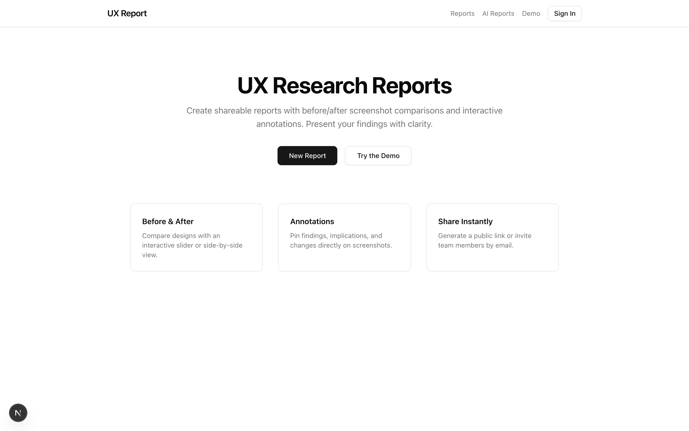
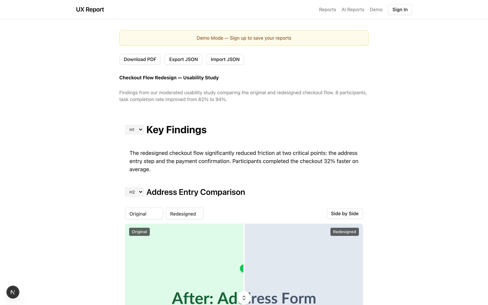
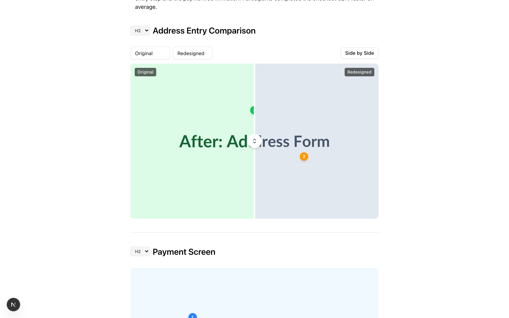
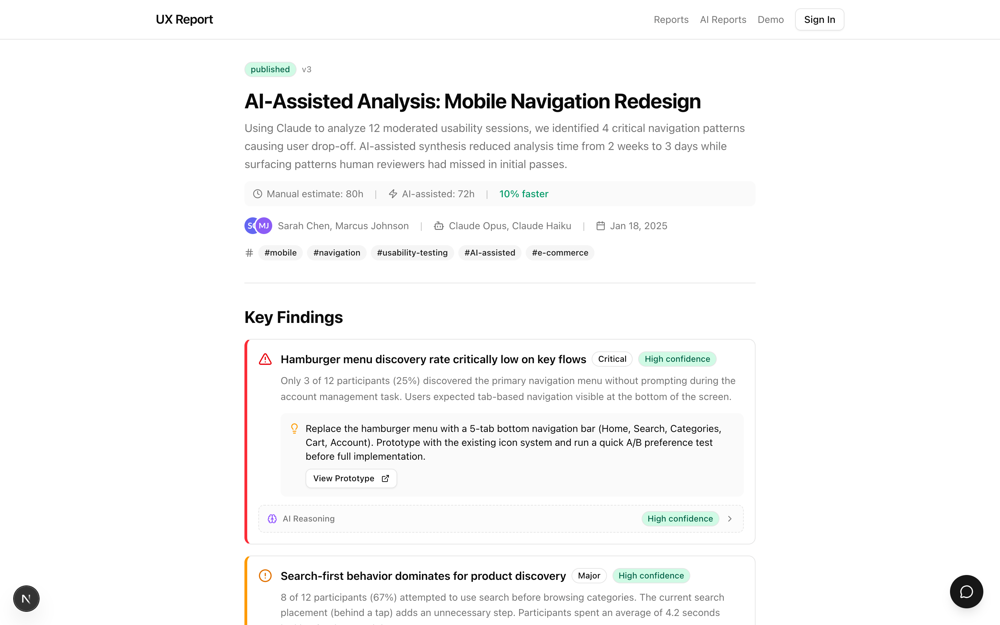
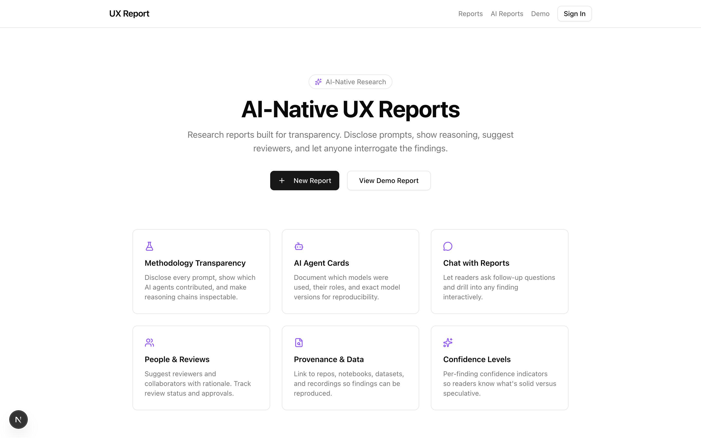

# UX Report App

A Next.js app for building shareable UX research reports — with interactive
before/after comparisons, pinned annotations, PDF export, and a separate
AI-native report mode that surfaces methodology, prompts, model versions, and
reasoning behind every finding.



---

## Two report modes

The app ships with two parallel report systems that share a UI shell but
target different workflows:

| Route          | Mode                | Use case                                                                 |
| -------------- | ------------------- | ------------------------------------------------------------------------ |
| `/reports`     | **Classic**         | Traditional usability studies — text, headings, images, before/after.    |
| `/ai-reports`  | **AI-native**       | Reports built with AI assistance — discloses prompts, agents, reasoning. |

Try them without signing up:

- Classic demo → [`/demo`](http://localhost:3000/demo)
- AI-native demo → [`/ai-reports/demo`](http://localhost:3000/ai-reports/demo)

---

## The classic report builder

Block-based editor with five primitives — text, heading, image, comparison,
divider — plus a persistent toolbar for adding new blocks inline.



### Before / after comparisons

Every comparison block supports two render modes — an interactive **slider**
that wipes between original and redesigned screenshots, or a **side-by-side**
layout for static viewing. Both modes preserve annotation pins.



### Pinned annotations

Drop pins anywhere on an image or comparison. Each pin opens a callout for
findings, implications, or proposed changes — perfect for walking a
stakeholder through specific moments in a flow.

### Export and share

- **PDF export** via `html-to-image` + `jspdf` (handles Tailwind v4's
  `oklch()` colors that `html2canvas` cannot parse). Loaded on demand so the
  ~400KB of PDF tooling stays out of the initial bundle.
- **JSON import / export** for portability between accounts. Imported HTML is
  sanitized and the payload shape is validated before it touches storage.
- **Public share links** and email invites via Supabase row-level security.

---

## The AI-native report mode

A second report system built around transparency. Every finding can carry
agent attribution, confidence, prompt provenance, and a chat surface so
readers can interrogate the analysis.



### What's different

| Feature                | Classic                   | AI-Native                                                             |
| ---------------------- | ------------------------- | --------------------------------------------------------------------- |
| Authorship             | Human authors only        | Human authors **and** AI contributor cards (model name, model ID, role) |
| Findings               | Free-form blocks          | Structured findings with severity + confidence                        |
| Methodology            | Implicit                  | Explicit: prompts, reasoning summaries, chain-of-thought              |
| People                 | Editor permissions        | Suggested reviewers + collaborators with rationale                    |
| Provenance             | —                         | Linked repos, datasets, notebooks, recordings                         |
| Reader interactivity   | Read-only                 | Chat panel for follow-up questions on any finding                     |
| Status                 | Draft / Published         | Draft / In-review / Published with versioning                         |



### Components

The AI report viewer composes a handful of dedicated panels — see
[`src/components/ai-report/`](src/components/ai-report):

- `report-hero.tsx` — title, status, version, authors, AI contributors, tags
- `finding-card.tsx` — finding with severity, confidence, recommendation
- `methodology-panel.tsx` + `prompt-card.tsx` — disclosed prompts and reasoning
- `agent-card.tsx` — per-model contributor card (Opus, Haiku, etc.)
- `people-panel.tsx` + `person-card.tsx` — suggested reviewers/collaborators
- `review-status-card.tsx` — review state per reviewer
- `provenance-panel.tsx` + `repo-card.tsx` + `data-source-card.tsx`
- `connections-panel.tsx` — related reports and tags
- `chat-panel.tsx` — interrogate findings inline
- `confidence-badge.tsx`, `reasoning-trace.tsx` — supporting UI

---

## Tech stack

- **Next.js 16** (App Router, Turbopack) on **React 19**
- **Tailwind CSS v4** + **shadcn/ui** (Radix primitives)
- **Supabase** — Postgres, Auth, RLS
- **html-to-image + jspdf** — client-side PDF export
- **isomorphic-dompurify** — SSR-safe HTML sanitization for report content
- **Vitest + jsdom** — unit tests for storage, import validation, and sanitization
- **TypeScript 5.9.3** (locked — see commit `05f7c8b`)

---

## Getting started

### 1. Install

```bash
git clone https://github.com/jessholbrook/ux-report-app.git
cd ux-report-app
npm install
```

### 2. Configure Supabase (optional)

The app runs without Supabase using local-storage reports — useful for
demoing the editor. To enable accounts, sharing, and persistence:

```bash
cp .env.example .env.local
```

Fill in your Supabase project credentials:

```env
NEXT_PUBLIC_SUPABASE_URL=https://<project>.supabase.co
NEXT_PUBLIC_SUPABASE_ANON_KEY=<anon-key>
```

Then run the schema migrations against your Supabase project, in order:

1. `supabase/migrations/001_initial_schema.sql` — tables, RLS, storage bucket
2. `supabase/migrations/002_fix_rls_write_access.sql` — **required**; restricts
   block/annotation writes on public/shared reports to owners only (001 alone
   lets any viewer write). Don't skip this.

### 3. Run

```bash
npm run dev
```

Open [http://localhost:3000](http://localhost:3000).

### 4. Try the demos

- [`/demo`](http://localhost:3000/demo) — fully editable classic report
- [`/ai-reports/demo`](http://localhost:3000/ai-reports/demo) — AI-native report

---

## Project layout

```
src/
├── app/
│   ├── reports/            # Classic report routes (list, new, [id], edit)
│   ├── ai-reports/         # AI-native report routes
│   ├── demo/               # Public classic demo (no auth)
│   ├── auth/               # Supabase auth pages
│   └── api/
├── components/
│   ├── report/             # Classic editor + viewer + block primitives
│   ├── ai-report/          # AI-native panels (methodology, agents, etc.)
│   ├── annotations/        # Pin / callout / layer
│   ├── comparison/         # Slider + side-by-side
│   ├── export/             # PDF + JSON
│   ├── sharing/            # Share dialog + public links
│   ├── dashboard/          # Report list
│   ├── layout/             # Header, nav
│   └── ui/                 # shadcn primitives
├── contexts/               # React contexts (auth, report state)
├── hooks/
├── lib/                    # Supabase client, local-storage, sanitize, types
└── test/                   # Vitest setup
supabase/
└── migrations/             # SQL schema (001 initial, 002 RLS write fix)
```

---

## Scripts

```bash
npm run dev        # Next.js dev server (Turbopack) on :3000
npm run build      # Production build
npm run start      # Run production build
npm run lint       # ESLint
npm test           # Run the Vitest suite once
npm run test:watch # Vitest in watch mode
```

## Testing & CI

Unit tests live next to the code they cover (`src/**/*.test.ts`) and run under
Vitest + jsdom. Coverage focuses on the pure, failure-prone logic:

- `blocks.test.ts` — block reordering index math
- `import-json.test.ts` — imported-payload validation
- `local-storage.test.ts` — save/load round-trips and quota-failure handling
- `sanitize.test.ts` — HTML sanitization strips scripts, event handlers, and
  `javascript:` URLs

[`.github/workflows/ci.yml`](.github/workflows/ci.yml) runs `tsc --noEmit`,
ESLint, the test suite, and a production build on every push and PR.

---

## Deploy

Optimised for Vercel. Push to `main` and the Vercel project picks it up
automatically. Make sure `NEXT_PUBLIC_SUPABASE_URL` and
`NEXT_PUBLIC_SUPABASE_ANON_KEY` are set in the Vercel project's environment
variables — they're required at build time, not just runtime.
